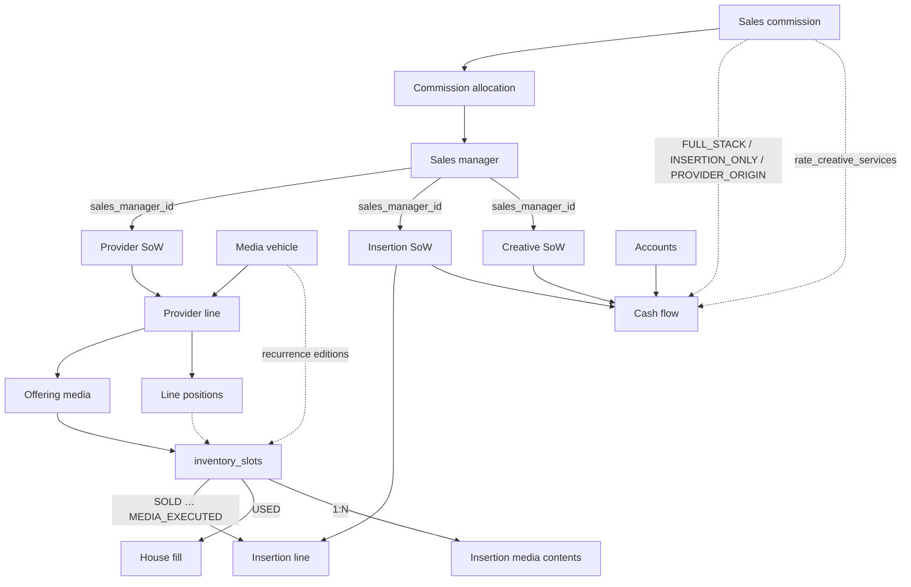
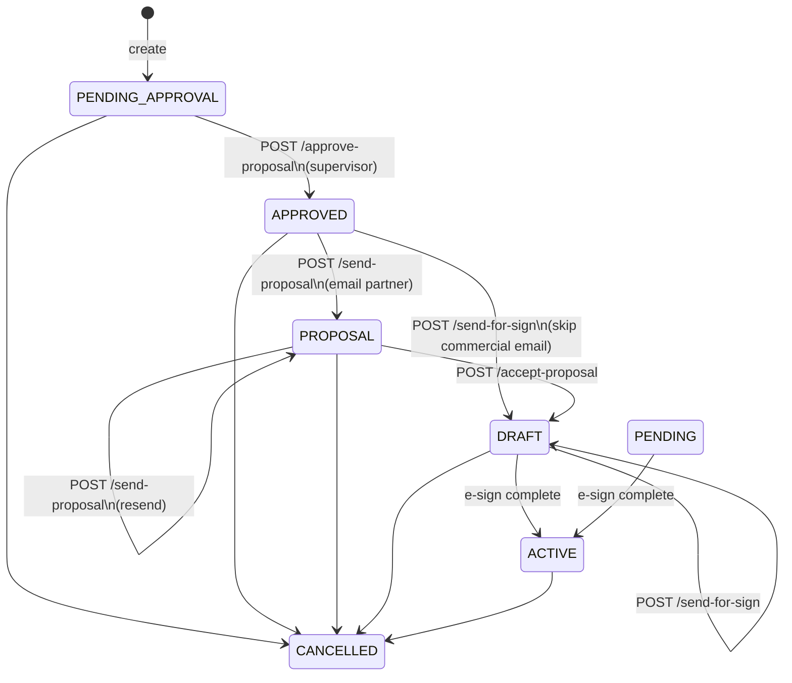
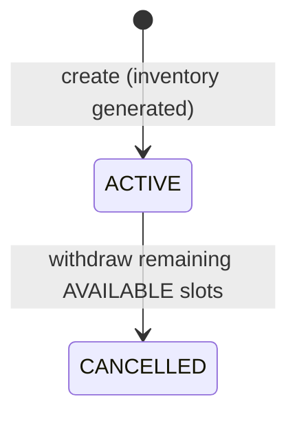
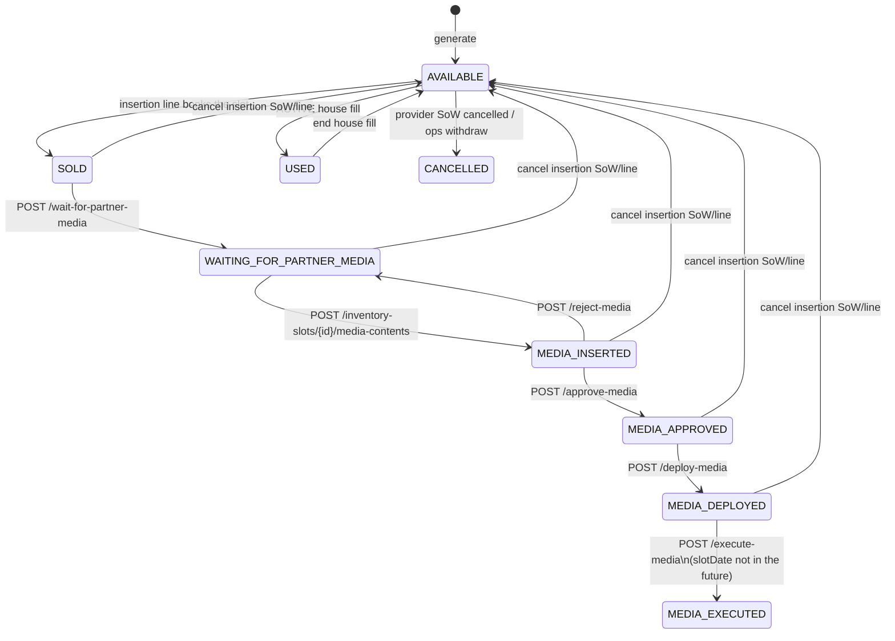
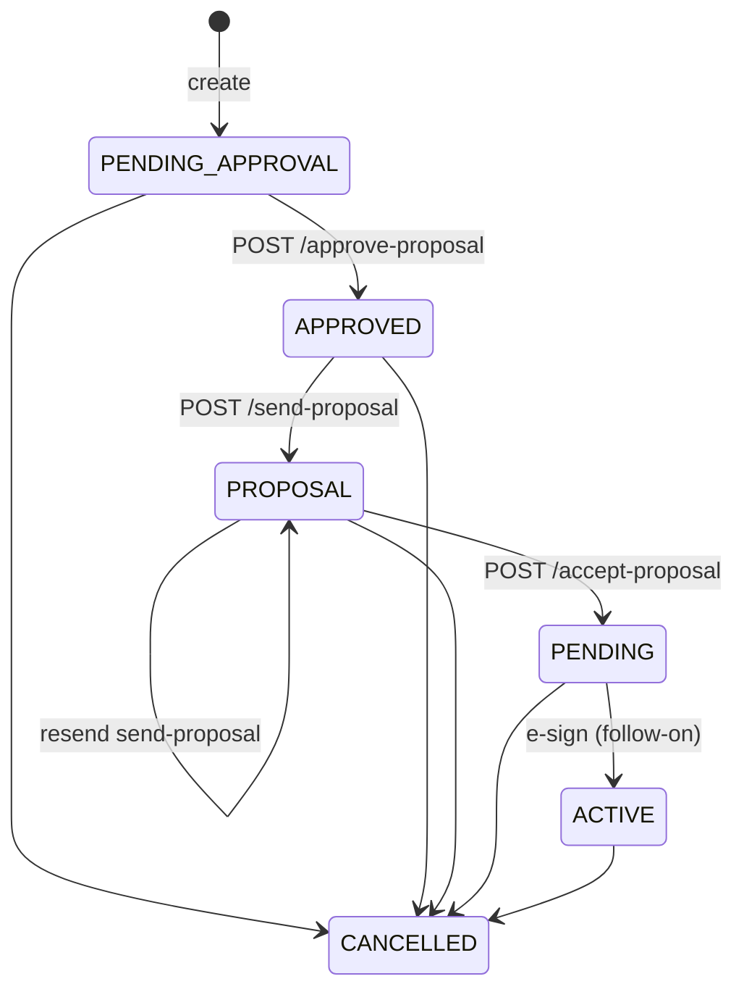

# Shine Media database

Logical domain model and physical schema for the **shine-media** database.

- Changelog: [`shine-media/changelog/db.changelog-master.yaml`](shine-media/changelog/db.changelog-master.yaml)
- Datasource id: `shine-media`
- Dev: H2 TCP `jdbc:h2:tcp://127.0.0.1:9092/shine-media`
- Prod: PostgreSQL database `shine-media` (`SHINE_MEDIA_DB_*`)

Enums are stored as `VARCHAR` codes (uppercase). Money and rates use `DECIMAL(19,4)`.

---

## Domain overview

Shine Media sells advertising **insertions** against **media vehicles** (capacity). Sellable capacity comes from **provider contracts** that are either **third-party** (`contract_type = THIRD_PARTY`) or **Shine-owned house inventory** (`contract_type = HOUSE`), and may optionally be backed by **creative** contracts. Sellable capacity is materialized as **inventory slots** on each **offering** (edition dates × anonymous capacity or declared **positions** such as print pages). **Sales managers** (`users` with role `SALES_MANAGER`) own SoWs via `sales_manager_id` and earn commission from a **sales commission** plan (allocated per user). Money is posted to **accounts** (chart of accounts: SoW revenue and manual expenses) as **cash flow** rows (receivables and payables). People act through **users** linked to **parties** and **roles**. Operational cron rows (`scheduled_jobs` + `scheduled_job_parameters`) persist a plugin `job_id`, Quartz cron, and key/value parameters; the host `JobScheduler` (Quartz in porto-api) provisions RAM triggers at startup. `scheduled-jobs` plugins implement the work and never import Quartz.

**House vs house fill:** a `HOUSE` provider SoW is Shine-owned inventory (DOOH, OOH, print, radio, TV, …). A **house fill** (`house_fills`) is leftover unsold slots on any offering — different concept.



---

## Entity catalog

REST base path: `/api/v1.0.0`. Full request/response shapes: `config/shine-media/openapi.yaml`.

Catalog order follows insert dependencies: independent reference data first, then people and commercial catalogs, then provider / insertion / creative SoWs (and the rows they generate), then cash flow, then operations (`scheduled_jobs`).

#### Geography and media taxonomy

### Business area

| Column | Notes |
|--------|--------|
| id, name, description | Industry / vertical for a party |

**APIs**

| Method | Path | Purpose |
|--------|------|---------|
| GET/POST | `/business-areas` | List (page/size) / create |
| GET | `/business-areas/search?q=` | Search |
| GET/PUT/DELETE | `/business-areas/{id}` | Read / update / delete |

### City

| Column | Notes |
|--------|--------|
| id, name, state, country, icon_url | Geography for locations and regulations |

**APIs**

| Method | Path | Purpose |
|--------|------|---------|
| GET/POST | `/cities` | List / create |
| GET | `/cities/search?q=` | Search |
| GET/PUT/DELETE | `/cities/{id}` | Read / update / delete |

### Media category

Top-level taxonomy (changeset **8**): **Audio**, **Video**, **Out-of-Home**, **Digital Display**, **Print**. Later seed also adds **Cinema**, **Retail Media**, **Sponsorship & Content**, **Experiential**.

| Column | Notes |
|--------|--------|
| id, name, description, icon_url | |

**APIs**

| Method | Path | Purpose |
|--------|------|---------|
| GET/POST | `/media-categories` | List / create |
| GET | `/media-categories/search?q=` | Search |
| GET/PUT/DELETE | `/media-categories/{id}` | Read / update / delete |

### Media channel

Examples: DOOH, OOH (Static), **Street Flyer Distribution** (handing leaflets to pedestrians; not fly-posting), Linear Radio, Digital Audio, Linear TV, Online Video (OLV), CTV/TV Streaming, Digital Display, Print. Other seeded channels include Transit Interiors, Letterbox / Direct Mail, Experiential / Ambient (street teams / sampling), cinema, retail in-store, and sponsorship/creator formats.

| Column | Notes |
|--------|--------|
| id, name, description, media_category_id, requires_location, icon_url | `requires_location` true for DOOH / OOH. `icon_url` is the channel tile for the future client UI (YouTube, DOOH, digital display, …). `PUT /media-channels/{id}/icon` stores the file at `data/shine-media/images/media-channel-icons/{id}/icon.{ext}` (storage key `images/media-channel-icons/…`) via DocumentStorage and writes that URL here. SoW PDFs stay under `data/shine-media/documents`. Type is sniffed from magic bytes (declared Content-Type must match). SVG is XML-sanitized (no DTD, script, event handlers, or external hrefs). Raster size is read from headers before a full decode. Format/size rules live in `media-channel-crud` YAML `icon.*` (also `GET /media-channels/icon-spec`). Default: 128×128 square PNG/WebP or SVG, ≤128 KiB, transparent sRGB. `GET …/icon` serves the uploaded file only (does not proxy an external URL). |

**APIs**

| Method | Path | Purpose |
|--------|------|---------|
| GET/POST | `/media-channels` | List / create |
| GET | `/media-channels/search?q=` | Search |
| GET/PUT/DELETE | `/media-channels/{id}` | Read / update / delete |
| GET | `/media-channels/icon-spec` | Upload rules (types, max bytes, pixels) |
| GET/PUT | `/media-channels/{id}/icon` | Download / upload channel tile |

### City regulations

| Column | Notes |
|--------|--------|
| id, city_id, media_channel_id, regulations, effective_date, document_url | Channel-specific rules in a city |

**APIs**

| Method | Path | Purpose |
|--------|------|---------|
| GET/POST | `/city-regulations` | List / create |
| GET | `/city-regulations/search?q=` | Search |
| GET/PUT/DELETE | `/city-regulations/{id}` | Read / update / delete |

### Media location

| Column | Notes |
|--------|--------|
| id, name, address, coordinates, city_id, media_channel_id | |
| status | `WORKING`, `DISABLED`, `MAINTENANCE` |

**APIs**

| Method | Path | Purpose |
|--------|------|---------|
| GET/POST | `/media-locations` | List / create |
| GET | `/media-locations/search?q=` | Search |
| GET/PUT/DELETE | `/media-locations/{id}` | Read / update / delete |

### Media vehicle

Defines **how much** inventory exists per allocation unit for a channel (optional location). Bookings do **not** decrement a floating pool — they allocate rows in `inventory_slots` (see below).

For **DOOH**, inventory is **one exclusive minute** per slot. Daily capacity is operating minutes (equal `operating_from` / `operating_to` is a **24-hour** day → **1440** minutes). Seeded **BRL** DOOH runs **06:00**–**00:00** (18h) → **1080** exclusive minutes. `insertion_duration_minutes` is the **catalogue default** buyer duration (seeded **3 minutes**), not the inventory quantum. The buyer selects duration at booking; a 5-minute insertion consumes 5 slots and is charged 5 × `minute_price`. Creative file length (`duration_seconds` on the content spec, often 10s) may loop inside the reserved exclusive time; it is not the booking unit.

| Column | Notes |
|--------|--------|
| id, media_channel_id, location_id? | |
| name | |
| schedule_type | `CONTINUOUS`, `DAILY`, `PROGRAM`, `EDITION`, `ASSET` |
| capacity_type | `PER_DAY`, `PER_EDITION`, `PER_ASSET`, `PER_PROGRAM` |
| capacity_quantity | Anonymous slots generated per edition date when the line has no positions. For DOOH, overwritten from operating minutes when the operating window is set (one slot = one exclusive minute). **Not** audience reach. |
| duration_hint | e.g. 60 pages, 1 min exclusive inventory |
| air_time, recurrence | e.g. 16:00 / `DAILY`; recurrence drives **edition dates**: `HOURLY`/`DAILY`/blank → every calendar day; `WEEKLY` / `FORTNIGHTLY` / `MONTHLY` → stepped editions |
| operating_from?, operating_to? | Daily window (`TIME`). Equal times = 24h |
| insertion_duration_minutes? | Catalogue default exclusive dwell the buyer may change at booking (minutes) |
| audience_capacity? | Audience reach of the face (people, impressions, or vehicles). The API stores this quantity; **the client** computes period totals (e.g. visualisations/month = capacity × days) when the unit is per-day |
| audience_capacity_unit? | `PEOPLE_PER_DAY`, `IMPRESSIONS_PER_DAY`, or `VEHICLES_PER_DAY` |

| Example | Capacity |
|---------|----------|
| Magazine 60 pages, 10 insertions | `PER_EDITION` = 10 |
| Daily radio TOC, 100 insertions | `PER_DAY` = 100 |
| Daily TV TOC, 1000 | `PER_DAY` = 1000 |
| YouTube 30min, 3 mid-rolls | `PER_ASSET` = 3 |
| TV program 16:00, 10 | `PER_PROGRAM` = 10 |
| Radio 07:00, 10 | `PER_PROGRAM` = 10 |
| Billboard | `PER_DAY` / continuous = 1 |
| DOOH 24h, 1 min exclusive inventory | `PER_DAY` = 1440 |
| DOOH 06:00–00:00, 1 min exclusive (BRL seed) | `PER_DAY` = 1080 |
| Digital display, 50 | `PER_DAY` (share of a loop) = 50 |

**APIs**

| Method | Path | Purpose |
|--------|------|---------|
| GET/POST | `/media-vehicles` | List / create |
| GET | `/media-vehicles/search?q=` | Search |
| GET/PUT/DELETE | `/media-vehicles/{id}` | Read / update / delete |

#### Parties, users and access

### Party

Client or supplier (company or person) on contracts. Contacts are **users** with party roles.

| Column | Notes |
|--------|--------|
| id, name, type, address, tax_number_id, business_area_id | type: `INSERTION`, `PROVIDER`, `CREATIVE` |

**APIs**

| Method | Path | Purpose |
|--------|------|---------|
| GET/POST | `/parties` | List / create |
| GET | `/parties/search?q=` | Search |
| GET/PUT/DELETE | `/parties/{id}` | Read / update / delete |

### User / role / permissions

| Entity | Columns |
|--------|---------|
| User | id, first_name, last_name, address, phone, email, party_id?, photo_url, status (`PENDING`, `ENABLED`, `DISABLED`), `password_hash` (bcrypt), `password_expires_at` |
| Role | id, name — `SALES_MANAGER`, `ADMIN`, `SUPERVISOR`, `ADVERTISER`, `PROVIDER`, `CONTENT_SUPPLIER` |
| Role permission | id, role_id, permission_code — e.g. `cash_flow.create` |
| User role | id, user_id, role_id | |

`party_id` null on user = internal staff.

**APIs**

| Method | Path | Purpose |
|--------|------|---------|
| GET/POST | `/users` | List / create |
| GET | `/users/search?q=` | Search |
| GET/PUT/DELETE | `/users/{id}` | Read / update / delete |
| POST | `/auth/token` | Local IdP password grant |
| POST | `/auth/password` | Change current user's expired or current password |
| GET/POST | `/roles` | List / create |
| GET | `/roles/search?q=` | Search |
| GET/PUT/DELETE | `/roles/{id}` | Read / update / delete |
| GET/POST | `/role-permissions` | List / create |
| GET | `/role-permissions/search?q=` | Search |
| GET/PUT/DELETE | `/role-permissions/{id}` | Read / update / delete |
| GET/POST | `/user-roles` | List / create |
| GET | `/user-roles/search?q=` | Search |
| GET/PUT/DELETE | `/user-roles/{id}` | Read / update / delete |

---

### Sales commission

| Column | Notes |
|--------|--------|
| id, name | Commission plan |
| rate_full_stack | Same manager sold provider origin + insertion |
| rate_insertion_only | Insertion manager when provider is house or another manager |
| rate_provider_origin | Provider manager when different from insertion manager |
| rate_creative_services | Creative SoW only (never mixed into media full-stack) |

**How media commission scenarios map**

- Same manager on provider and insertion → one payable at `FULL_STACK` (do not also pay origin + insertion).
- Different managers → two payables: insertion manager `INSERTION_ONLY` + provider manager `PROVIDER_ORIGIN`.
- **House inventory** (`contract_type = HOUSE`, and therefore `sales_manager_id` null) → only `INSERTION_ONLY` for the insertion SoW manager; no `PROVIDER_ORIGIN`. Do **not** emit a `PROVIDER_FEE` payable (Shine already owns the inventory).

Rule at cash-flow generation (insertion `PENDING_APPROVAL` → `FORECAST`; `POST …/approve-proposal` flips those rows to `ACTUAL`; `PROPOSAL` / `PENDING` / `ACTIVE` keep `ACTUAL`; regenerate when lines or commercial fields change; clear `FORECAST` on `CANCELLED`):

```
providerSow.contract_type
providerMgr  = providerSow.sales_manager_id   // always null when HOUSE
insertionMgr = insertionSow.sales_manager_id

if providerSow.contract_type == HOUSE
  → pay insertionMgr @ INSERTION_ONLY
  → no PROVIDER_FEE payable to the house party
else if providerMgr == null
  → pay insertionMgr @ INSERTION_ONLY
else if providerMgr == insertionMgr
  → pay insertionMgr @ FULL_STACK
else
  → pay insertionMgr @ INSERTION_ONLY
  → pay providerMgr  @ PROVIDER_ORIGIN
```

**Creative commission** uses `rate_creative_services` only when a Creative SoW is activated/collected. Do not use `FULL_STACK` for creative. If the same person sold insertion and creative, they get media commission on the insertion SoW **and** creative commission on the creative total — two SoWs, two calculations.

**APIs**

| Method | Path | Purpose |
|--------|------|---------|
| GET/POST | `/sales-commissions` | List / create |
| GET | `/sales-commissions/search?q=` | Search |
| GET/PUT/DELETE | `/sales-commissions/{id}` | Read / update / delete |

### Commission allocation

| Column | Notes |
|--------|--------|
| id, user_id, commission_id | Which sales commission plan a user uses |

**APIs**

| Method | Path | Purpose |
|--------|------|---------|
| GET/POST | `/commission-allocations` | List / create |
| GET | `/commission-allocations/search?q=` | Search |
| GET/PUT/DELETE | `/commission-allocations/{id}` | Read / update / delete |

#### Commercial catalog

### Payment condition

| Column | Notes |
|--------|--------|
| id, name, number_installments | Drives cash-flow installment count on insertion/creative SoWs |

**APIs**

| Method | Path | Purpose |
|--------|------|---------|
| GET/POST | `/payment-conditions` | List / create |
| GET | `/payment-conditions/search?q=` | Search |
| GET/PUT/DELETE | `/payment-conditions/{id}` | Read / update / delete |

### Company legal entity

One row per country where the operating company (Shine Media) is incorporated. Supplies the company party block on SoW PDFs (legal name, address, tax id).

| Column | Notes |
|--------|--------|
| country_code | Unique ISO code (`AU`, `BR`, …) |
| locale, legal_name, trading_name, address | |
| tax_id_type, tax_number | `ABN` / `CNPJ` / … — **replace seeded placeholders before production** |
| governing_law, legislation_note | Country-language governing law + generic note on local urban/advertising compliance (provider SoW §7; updated in changeset **49** for AU and BR) |
| contact_email | |

CRUD: `/company-legal-entities`. Seeded AU (ABN placeholder) and BR (CNPJ placeholder) in changeset **39** (`shine_media_legal_entities`); table renamed to `company_legal_entities` in changeset **41**.

**APIs**

| Method | Path | Purpose |
|--------|------|---------|
| GET/POST | `/company-legal-entities` | List / create |
| GET | `/company-legal-entities/search?q=` | Search |
| GET/PUT/DELETE | `/company-legal-entities/{id}` | Read / update / delete |

### Template

Catalog of SoW, proposal, and proposal-email HTML. Table `templates`. REST `/api/v1.0.0/templates`.

| Column | Notes |
|--------|--------|
| id, type, name, media_channel_id | type: `INSERTION`, `PROVIDER`, `CREATIVE`, `PROPOSAL` (provider partnership), `INSERTION_PROPOSAL` (advertiser campaign). `media_channel_id` is required for every type (SoW PDF, proposal PDF, and proposal email are all per media channel + country). Unique `(type, media_channel_id, country_code)` — insertion proposals cannot reuse `PROPOSAL` |
| country_code, locale | ISO country (`AU`, `BR`, …) and locale (`en-AU`, `pt-BR`) — one HTML template language per country |
| document_template_key | Shared HTML file key in DocumentStorage (e.g. `provider-AU`, `insertion-proposal-AU`). Many catalog rows can share one key; PUT overwrites the latest file for that key |
| document_template_url | Storage URL for `sow-templates/{key}.html` (`file://…/data/shine-media/templates/{key}.html` locally, `s3://…/sow-templates/{key}.html` in production). Changeset **65** rewrites older `config/shine-media/templates/` and `classpath:sow-templates/` pointers |
| email_template_key, email_template_url | Proposal email HTML keys/URLs (`provider-proposal-email-AU`, `insertion-proposal-email-AU`, …). Same shared-file rules as `document_template_*` |

HTML lives in **one** place: DocumentStorage. Locally (`storage.backend=filesystem`) that is
`${PORTO_API_HOME}/data/shine-media/templates/{key}.html` (`storage.filesystem.templates-root`).
Those `*.html` files are the latest version and are tracked in git. Production uses the same
storage keys on S3 (`storage.backend=s3`). There is no factory copy under `config/`.
`PUT /templates/{id}/document` (and email-document) overwrites the shared file for that key;
every catalog row with the same key sees it. `GET` / `send-for-sign` / `send-proposal` read
storage only — missing HTML is an error (upload via PUT). Deleting a catalog row does **not**
delete the shared HTML. PDFs stay under `storage.filesystem.root` (`data/shine-media/documents`).

**APIs**

| Method | Path | Purpose |
|--------|------|---------|
| GET/POST | `/templates` | List / create catalog rows |
| GET | `/templates/search?q=` | Search |
| GET/PUT/DELETE | `/templates/{id}` | Read / update / delete (does not delete shared HTML) |
| GET/PUT | `/templates/{id}/document` | Download / overwrite SoW or proposal HTML for that row’s `document_template_key` |
| GET/PUT | `/templates/{id}/email-document` | Download / overwrite proposal email HTML |

`PROPOSAL` templates (seeded per channel in changeset **55**) are the **provider** commercial partnership offer for that media type: PDF HTML (`provider-proposal-AU` / `provider-proposal-BR`) plus email HTML (`provider-proposal-email-AU` / `…-BR`). `POST /media-provider-sows/{id}/send-proposal` and `send-for-sign` select catalog rows from `media-provider-sow-crud` YAML `template.{mediaType}.{country}.sow` / `.proposal` / `.email` (media type slug of the SoW template’s channel: `DOOH`, `OOH_STATIC`, `PRINT`, `OLV`). Optional `proposalTemplateId` overrides the proposal PDF row. Renders PDF + email, stores `provider-sows/{id}/proposal.pdf` (and a dated snapshot), and emails the provider contact with the PDF attached. The email is in the template language and signed by the SoW `salesManagerId` user (name, phone, email). BR copy: “A Shine Media, através de {gerente}, propõe uma parceria de mídia…”. In local/dev, `email-smtp` `smtp.redirectTo` rewrites every SMTP recipient (currently `rodrigo.dinis@outlook.com`); the original To is kept as `X-Original-To`. Delivery uses Outlook SMTP (`smtp-mail.outlook.com`) when `smtp.passwordFile` / `SHINE_SMTP_PASSWORD` is set; Mailpit (`localhost:1025`) only captures mail locally.

`INSERTION` / `INSERTION_PROPOSAL` templates (changeset **58**) are the **advertiser** insertion SoW and campaign proposal for the same channel × country set as PROVIDER rows. Shared HTML keys: `insertion-AU` / `insertion-BR` (legal SoW; DocuSign anchors `/sig-advertiser/` + `/sig-shine/`), `insertion-proposal-AU` / `…-BR` (proposal PDF), `insertion-proposal-email-AU` / `…-BR` (proposal email). Thymeleaf model: `InsertionSowDocumentModel` (`advertiser`, insertion `sow`, `lines` as `InsertionSowLineDocumentRow`). `media-insertion-sow-crud` uses connectors `STORAGE`, `EMAIL`, `RENDER`, `PARTY`, `TEMPLATE`, `LEGAL`, `USER` and resolves `INSERTION_PROPOSAL` by the SoW template’s channel + country (optional `proposalTemplateId`).

### Documents, e-sign, email

Swappable client adapters (capabilities in `shine-media-dtos`). JARs for email/storage/e-sign/render live in `plugins/client-adapters/shared/`; YAML stays `plugins/client-adapters/shine-media/{id}-{env}.yaml`. Processor connectors on `media-provider-sow-crud`: `STORAGE`, `ESIGN`, `EMAIL`, `RENDER`, `PARTY`, `TEMPLATE`, `CHANNEL`, `LEGAL`, `USER`.

| Adapter id | Capability | Dev | Prod |
|------------|------------|-----|------|
| `document-storage-s3` | `DocumentStorage` | Documents: `data/shine-media/documents`. Images: `data/shine-media/images`. Latest HTML (`sow-templates/{key}.html`): `data/shine-media/templates/{key}.html`. Slot artefacts (`media-artefacts/{slotId}/{contentId}.{ext}`): `data/shine-media/media-artefacts/{slotId}/{contentId}.{ext}` | `storage.backend=s3` + bucket/region (same keys) |
| `document-render-thymeleaf` | `DocumentRenderer` | Inline HTML from DocumentStorage → PDF / processed HTML | Same |
| `e-sign-docusign` | `ESign` | `esign.backend=stub`; stub files under `~/tmp/shine-media/esign-stub` | `esign.backend=docusign` + JWT (PKCS#8 `BEGIN PRIVATE KEY`) |
| `email-smtp` | `EmailSender` | Mailpit (`localhost:1025`, UI `http://localhost:8025`) or Outlook (`smtp-mail.outlook.com:587` + `smtp.redirectTo`) | SES or any SMTP |

`email-smtp` rebuilds Jakarta Mail’s `CommandMap` under the plugin classloader when sending so PDF attachments (`multipart/mixed`) resolve — the host TCCL only has `jakarta.activation-api`. DocuSign emails signers; SMTP is for `notifyEmail` and proposal PDFs. Connect HMAC POSTs to `POST /api/v1.0.0/media-provider-sows/esign-webhook`.

**APIs** (not separate resources; wired on SoWs + adapters)

| Method | Path | Purpose |
|--------|------|---------|
| GET/PUT | `/templates/{id}/document` | Latest SoW/proposal HTML in DocumentStorage |
| GET/PUT | `/templates/{id}/email-document` | Latest proposal email HTML |
| POST | `/media-provider-sows/{id}/send-for-sign` | Render PDF (or accept `documentPdf`) and start dual e-sign |
| POST | `/media-provider-sows/esign-webhook` | DocuSign Connect HMAC callback → store signed PDF, `ACTIVE` |
| POST | `/media-provider-sows/esign-complete` | Manual `{ "envelopeId" }` fallback |
| GET | `/media-provider-sows/{id}/signatures` | Dual-sign rows (`sow_signatures`) |
| POST | `/media-provider-sows/{id}/send-proposal` | Email provider contact + store proposal PDF |
| POST | `/media-insertion-sows/{id}/send-proposal` | Email advertiser + store proposal PDF |

Provider SoW PDFs are rendered from the HTML in DocumentStorage via `document-render-thymeleaf` (inline HTML → PDF) using the company legal entity for that country (`company_legal_entities`), the provider party, SoW header, and lines. The inventory table lists **Price per exclusive minute** / **Preço por minuto exclusivo** and an indicative default-insertion price. Clause visibility (`youtubeOnly` = all lines `PER_ASSET`; `doohMinutePriced` = any non-YouTube line and no null `minutePrice`; `genericInsertion` = any non-YouTube line and some null `minutePrice`) is set in Java (`ProviderSowClauseFlags`) — OGNL collection projection (`?[]`) is not supported. In BR HTML, avoid single-character DateTimeFormatter patterns inside OGNL (e.g. `#temporals.format(x, 'd')`): OGNL treats `'d'` as a `Character` and fails method overload resolution (`Unable to convert … Character … to Locale`). Use `'dd'` or separate `th:text` spans for day / month / year. Clauses define **Insertion** / **Inserção** as one exclusive exhibition for the duration the advertiser selects at booking, charged at duration × per-minute rate on DOOH (one inventory slot = one exclusive minute). Face monthly is indicative only. Signature blocks include AutoPlace markers `/sig-provider/` and `/sig-shine/` so DocuSign SignHere tabs sit on those lines (not at the top of page 1). Files are stored as `provider-sows/{id}/yyyyMMdd-{id}-not-signed.pdf` and `…-signed.pdf`. Brazilian dates (`1 de janeiro de 2026`) concatenate `#temporals.format` parts (`d`, `MMMM`, `yyyy`) — OGNL cannot parse DateTimeFormatter patterns that quote the word `de`. Money and large integers use `#numbers.formatDecimal` / `#numbers.formatInteger` with `'DEFAULT'` grouping so the template locale applies (`pt-BR` → `BRL 10.000,00`; `en-AU` → `AUD 10,000.00`). The three-argument `#numbers.formatDecimal(n, 1, 2)` form must not be used — Thymeleaf then sets thousands grouping to `NONE`.

### Account

Chart of accounts. Cash-flow rows post to an account. Revenue accounts are `RECEIVABLE`; expense accounts are `PAYABLE`.

| Column | Notes |
|--------|--------|
| id, code, name | `code` is unique (`INSERTION_REVENUE`, `POWER_SUPPLY`, …) |
| kind | `REVENUE` or `EXPENSE` |
| cash_flow_type | `RECEIVABLE` or `PAYABLE` (derived from kind) |
| system | API `systemDefined` — `true` = posted by SoW generation; identity (`code` / `kind` / `cash_flow_type`) is locked |
| house_typical | Hint for house-inventory operating costs (power, install, rent, …) |

Seeded system accounts: `INSERTION_REVENUE`, `CREATIVE_REVENUE`, `PROVIDER_FEE`, `SALES_COMMISSION`, `CREATIVE_SUPPLIER_COST`. Manual catalog: `GENERAL_REVENUE`, `POWER_SUPPLY`, `INSTALLATION`, `MAINTENANCE`, `SITE_RENT`, `GENERAL_EXPENSE`, `CLOUD_COMPUTING`. Operators can add more expense accounts.

**APIs**

| Method | Path | Purpose |
|--------|------|---------|
| GET/POST | `/accounts` | List / create |
| GET | `/accounts/search?q=` | Search |
| GET/PUT/DELETE | `/accounts/{id}` | Read / update / delete (blocked while cash-flow rows exist) |

### Creative services

Catalog of creative work types. **Rates are city-localized** on `creative_service_rates` (not on the service row).

| Column | Notes |
|--------|--------|
| id, name | Concept through final visual assets |

**APIs**

| Method | Path | Purpose |
|--------|------|---------|
| GET/POST | `/creative-services` | List / create |
| GET | `/creative-services/search?q=` | Search |
| GET/PUT/DELETE | `/creative-services/{id}` | Read / update / delete |

### Creative service rates

| Column | Notes |
|--------|--------|
| id, creative_service_id, city_id | Unique pair |
| hourly_rate, tax_rate | City-specific commercial rates |

**APIs**

| Method | Path | Purpose |
|--------|------|---------|
| GET/POST | `/creative-service-rates` | List / create |
| GET | `/creative-service-rates/search?q=` | Search |
| GET/PUT/DELETE | `/creative-service-rates/{id}` | Read / update / delete |

#### Provider contracts and inventory

### Media provider SoW

Provider contracts generate offering media (and eventually locations for location-based channels). Immutable after activation except `status` → `CANCELLED`. Totals/taxes come from lines. Currency is per SoW (second currency → second SoW).

| Column | Notes |
|--------|--------|
| id, creation_date, party_id, duration_from, duration_to | Duration bounds inventory slot generation |
| template_id, currency | |
| contract_type | `THIRD_PARTY` (external media owner) or `HOUSE` (Shine-owned inventory). Default `THIRD_PARTY` |
| services_fee_rate? | **Shine’s fee on third-party provider contracts only.** Required when `THIRD_PARTY`; **null** when `HOUSE` (Shine already owns the inventory — this is not a cut of house revenue). Applied to **net sold Insertion value before tax** (not unsold capacity, not tax charged to the advertiser). Example: insertion R$ 100 + ISS R$ 5 → advertiser pays R$ 105; Shine retains 10% of R$ 100 (= R$ 10); provider receives R$ 90 and remits tax on its share |
| signed_by_user_id, signature_reference, signed_sow_url | E-sign id + digitized signed doc (optional on HOUSE) |
| sales_manager_id | Origin salesperson for third-party; **must be null** on `HOUSE` |
| status | `PENDING_APPROVAL`, `APPROVED`, `PROPOSAL`, `DRAFT`, `PENDING`, `ACTIVE`, `CANCELLED` |
| envelope_id?, draft_document_url? | Dual e-sign envelope + stored draft PDF (THIRD_PARTY) |
| provider_contact_user_id? | User on `party_id` who is the commercial contact for partnership proposals (name/email from `users`) |
| proposal_document_url? | Latest stored proposal PDF (`provider-sows/{id}/proposal.pdf`) |
| payment_day_of_month | Day of month Shine pays the provider (1–28). Default **5**. Contract clause is monthly in arrears. |
| late_payment_fine_rate | Fraction of an overdue remittance charged as a fine when Shine pays late (`0.02` = 2%). Default **0.02**. Rendered in the signed provider SoW. |

`signed_by_user_id` must belong to `party_id` with role `PROVIDER` when set. Dual-sign rows live in **`sow_signatures`** (`PROVIDER` + `SHINE` sides).

**Create rules:** `HOUSE` → always **`ACTIVE`** (inventory generated immediately; no DocuSign; never a commercial proposal). `THIRD_PARTY` → always **`PENDING_APPROVAL`** (cannot create as `ACTIVE`, `APPROVED`, or `CANCELLED`). Fill lines while `PENDING_APPROVAL` or later (except `CANCELLED`). A supervisor (`SUPERVISOR` or `ADMIN`) must `POST /media-provider-sows/{id}/approve-proposal` (`PENDING_APPROVAL` → `APPROVED`) **before** the commercial offer can leave the building. Unapproved SoWs **cannot** `send-proposal` (HTTP 400). After approval: `POST …/send-proposal` emails the provider contact and sets **`PROPOSAL`**; `POST …/accept-proposal` moves `PROPOSAL` → `DRAFT`. `POST …/send-for-sign` is allowed from **`APPROVED`** (skip commercial email), **`DRAFT`**, or **`PENDING`**. Dual e-sign → **`ACTIVE`** (inventory generated) via Connect webhook or `esign-complete`. `GET …/proposal` downloads the latest proposal PDF.

**Lifecycle (THIRD_PARTY)**



**Local stub/render (THIRD_PARTY):** create SoW (`PENDING_APPROVAL`) with lines and `providerContactUserId` → `POST /media-provider-sows/{id}/approve-proposal` (supervisor) → `POST …/send-proposal` → Outlook (`smtp.redirectTo`) or Mailpit (`http://localhost:8025`) shows email + PDF → `POST …/accept-proposal` → `POST …/send-for-sign` (omit `documentPdf` to auto-render) → sign → Connect webhook or `POST …/esign-complete` → `ACTIVE` + inventory. `send-proposal` returns 400 until the SoW is `APPROVED`.

**Lifecycle (HOUSE)**



HMAC, JSON/XML payload, and `envelope-completed` filtering are implemented in `e-sign-docusign` (`docusign.webhookSecret` + `X-DocuSign-Signature-1`). The processor then stores the signed PDF and flips status to **`ACTIVE`**. `POST /media-provider-sows/esign-complete` with `{ "envelopeId" }` remains a manual fallback. Webhook retries on an already-`ACTIVE` SoW are ignored.

Rendered provider SoWs include: **clause 2** — services fee on **net sold Insertions before tax**; **clause 3** — inventory as label/value rows per line; **channel-specific prose** — when all lines are YouTube/OLV (`PER_ASSET`), definitions and pricing refer to spots per video only (no DOOH minute/slot language); DOOH lines get DOOH-only text; other channels get a shorter generic definition; **clause 4** — exclusivity scoped to contracted capacity; **clause 8** — proportional payment with fee/tax examples. Party blocks use the same tax-id label on both sides.

When status becomes **`ACTIVE`**, inventory slots are generated for all offerings on this SoW. When status becomes **`CANCELLED`**, remaining `AVAILABLE` slots are marked `CANCELLED`.

**No `payment_condition_id` on the provider SoW** (that table is for insertion/creative installment schedules). Provider remittance terms are the monthly `payment_day_of_month` on this SoW. Cash flow for media is created while a **Media Insertion SoW** is `PENDING_APPROVAL` (`status=FORECAST`). Supervisor `POST …/approve-proposal` (`APPROVED`) updates those rows to `ACTUAL`; later `PROPOSAL` / `PENDING` / `ACTIVE` keep `ACTUAL`. For `THIRD_PARTY`, provider payables (`PROVIDER_FEE`) and Shine’s `services_fee_rate` are derived from that insertion (linked offerings → provider lines / provider SoW). For `HOUSE`, do **not** create a provider payable or apply `services_fee_rate` — Shine keeps insertion revenue minus insertion-side commission. Effective print unit = `coalesce(position.slot_monthly_price, line.slot_monthly_price)`. On DOOH, `minute_price` is the rate card (seeded BRL **R$ 0.10 / 3 min ≈ 0.033333** per exclusive minute; AUD **10 / 3 ≈ 3.333333**). The buyer selects duration; quote = **N × duration × minute_price**. `slot_monthly_price` is the indicative price of one insertion at the catalogue default duration (3 min → R$ 0.10 / AUD 10.00). `monthly_price` is a catalog face total (kept when sent). Seeded **BRL** DOOH (changeset **48**) is **1080** exclusive minutes/day; a 30-day sold-out face at the default 3-min rate is still **R$ 1,080**. Seeded **AUD** DOOH is **1440** minutes/day at **3.333333**/min with catalog face monthly **4,800**. Provider SoW PDFs define **Insertion** / **Inserção** in those terms.

**APIs**

| Method | Path | Purpose |
|--------|------|---------|
| GET/POST | `/media-provider-sows` | List / create (`HOUSE` → `ACTIVE`; `THIRD_PARTY` → `PENDING_APPROVAL`) |
| GET | `/media-provider-sows/search?q=` | Search |
| GET/PUT/DELETE | `/media-provider-sows/{id}` | Read / update / delete |
| POST | `/media-provider-sows/{id}/approve-proposal` | Supervisor: `PENDING_APPROVAL` → `APPROVED` |
| POST | `/media-provider-sows/{id}/send-proposal` | Email partner; `APPROVED`/`PROPOSAL` → `PROPOSAL` |
| POST | `/media-provider-sows/{id}/accept-proposal` | `PROPOSAL` → `DRAFT` |
| GET | `/media-provider-sows/{id}/proposal` | Download latest proposal PDF |
| POST | `/media-provider-sows/{id}/send-for-sign` | Start dual e-sign (`APPROVED` / `DRAFT` / `PENDING`) |
| GET | `/media-provider-sows/{id}/signatures` | Dual-sign rows |
| POST | `/media-provider-sows/esign-complete` | Manual envelope complete |
| POST | `/media-provider-sows/esign-webhook` | DocuSign Connect callback |

### Media provider SoW line

| Column | Notes |
|--------|--------|
| id, media_provider_sow_id, media_channel_id, location_id | |
| slot_duration_minutes, media_vehicle_id | Catalogue **default** exclusive duration (seeded **3** on DOOH). The buyer may book a different duration. Creative length is content spec `duration_seconds` |
| number_of_insertions | In the vehicle’s recurrence unit. For DOOH this is **exclusive minutes per day** (BRL seed **1080**; AUD **1440**); with positions, should equal **sum(capacity)** |
| exposure | People per day at that location (OOH/DOOH). Copied onto the vehicle as `audience_capacity` (`PEOPLE_PER_DAY`) in changeset **44**, and onto the offering on create when audience is omitted |
| minute_price | Rate **per exclusive minute** when the line is time-based. Seeded BRL DOOH **0.033333** (0.10 / 3); AUD DOOH **3.333333** (10 / 3) |
| slot_monthly_price | Indicative unit for one insertion at the default duration (`minute_price × slot_duration_minutes`). Print still uses this as the insertion unit. Seeded BRL DOOH **0.10**; AUD DOOH **10.00** |
| monthly_price | Catalog face total. Seeded BRL DOOH **1,080**; AUD DOOH **4,800**. When a unit is sent it is kept; monthly is kept if sent, else minute × daily minutes (or slot × daily insertions) |

**APIs**

| Method | Path | Purpose |
|--------|------|---------|
| GET/POST | `/media-provider-sow-lines` | List / create (`contentSpec` nested on the body) |
| GET | `/media-provider-sow-lines/search?q=` | Search |
| GET/PUT/DELETE | `/media-provider-sow-lines/{id}` | Read / update / delete |

### Provider SoW line content spec

One format profile per provider line (1:1). Declares what creative assets may be attached; enforced when probing a CDN `storage_location_url` **or** inspecting uploaded artefact bytes on insertion/provider media content create/update.

| Column | Notes |
|--------|--------|
| media_provider_sow_line_id | Unique FK |
| media_kind | `IMAGE`, `VIDEO`, `AUDIO`, `DOCUMENT` |
| allowed_extensions | Lowercase CSV (`png,jpg,jpeg,pdf`, `mp4`, `mp3,aac`, …) |
| width_px?, height_px? | Exact pixels for images (and declared canvas for video) |
| duration_seconds? | Exact spot length for video/audio |
| duration_tolerance_seconds | Default 0 |
| max_bytes? | Size cap |

Probe rules: uploaded files are inspected in-process (no HTTP fetch). CDN URLs must be http(s) on an allowlisted host (`media-content.allowed-hosts`); resolved addresses may not be loopback, link-local, site-local, or multicast. MIME/extension via magic bytes (SVG/HTML rejected); image dimensions from file headers (max 8192×8192) before a full decode; MP4 duration via `moov/mvhd`. Mismatch → HTTP **400**. Missing spec on the line → **400**. Probed facts are stored on the content row (`detected_*`, `width_px`, `height_px`, `duration_seconds`, `byte_size`). Slot artefacts live at DocumentStorage key `media-artefacts/{slotId}/{contentId}.{ext}`.

**APIs** (no standalone resource; nested on the provider line)

| Method | Path | Purpose |
|--------|------|---------|
| GET/POST/PUT | `/media-provider-sow-lines`, `/media-provider-sow-lines/{id}` | Read/write `contentSpec` on the line DTO |
| POST/PUT | `/insertion-media-contents`, `/inventory-slots/{id}/media-contents` | Probe upload/CDN URL against the offering’s line spec |
| POST/PUT | `/provider-media-contents` | Probe against `provider_line_id` spec |

### Provider SoW line positions

Declared bookable **positions** on a provider SoW line (print pages, TV/radio breaks, video rolls, DOOH zones). Same mechanism for all channels — pages are one flavor of `position_code`.

| Column | Notes |
|--------|--------|
| id, media_provider_sow_line_id | |
| position_code | Stable key: `COVER`, `P5`, `DPS_12_13`, `MID_1`, … (unique per line) |
| position_label | Display label |
| sort_order | Base ordinal; inventory `slot_index` = `sort_order * 1000 + unit` |
| page_from?, page_to? | Optional physical page span (spreads) |
| capacity | Insertions this position holds per edition (default **1**). Multi-insertion pages use `capacity > 1` (same `position_code` on multiple inventory rows) |
| slot_monthly_price? | Optional rate-card **override**. `null` → use the provider line’s `slot_monthly_price`. Effective price = `coalesce(position.slot_monthly_price, line.slot_monthly_price)` (see `SlotRateCard`) |

If a line has **no** positions, generation uses anonymous `1..capacity_quantity` and pricing is the **line** rate only. Creating/updating a position regenerates missing edition×position×unit slots; deleting cancels `AVAILABLE` slots with that `position_code`. When positions exist, line `number_of_insertions` should match **sum of position capacities**.

Print example (Gazeta seed): line default **12,000 BRL**; `COVER` **28,000**, `OBC`/`DPS_12_13` **22,000**, mid-book (`P5`, `P20`, …) **null** → 12,000.

**APIs**

| Method | Path | Purpose |
|--------|------|---------|
| GET/POST | `/media-provider-sow-line-positions` | List / create (creates missing edition×position slots) |
| GET | `/media-provider-sow-line-positions/search?q=` | Search |
| GET/PUT/DELETE | `/media-provider-sow-line-positions/{id}` | Read / update / delete (`AVAILABLE` slots with that `position_code` cancelled on delete) |

### Offering media

Sellable product derived from a provider SoW line. Creating an offering (or activating its provider SoW) materializes `inventory_slots` for the provider duration.

Audience fields are optional and channel-specific: panels use `audience_capacity` + `audience_capacity_unit` (typically people/day); magazines use print run + subscribers; YouTube uses subscribers + visualisations. On create, if audience capacity is omitted it is copied from the vehicle, else from the provider line `exposure` as `PEOPLE_PER_DAY`. The API does **not** precompute monthly visualisations — the client multiplies capacity by days when the unit is per-day.

GET list/read/search also return the provider line’s catalog rate (`minute_price`, `slot_duration_minutes`, `slot_monthly_price`, `number_of_insertions`) so the client can pick duration and compute the quote. Those fields are not stored on `offering_media`.

| Column | Notes |
|--------|--------|
| id, name, media_provider_sow_line_id, tax_rate, icon_url | |
| audience_capacity? | Catalog snapshot of the vehicle’s audience reach |
| audience_capacity_unit? | `PEOPLE_PER_DAY`, `IMPRESSIONS_PER_DAY`, or `VEHICLES_PER_DAY` |
| print_run? | Copies printed per edition (print). Gazeta seed **45,000** |
| subscriber_count? | Magazine or YouTube channel subscribers. Mundo sem fim **1,950,000** (Aug 2026, @mundosemfim) |
| view_count? | **Average visualisations per video** on YouTube/OLV offerings (not channel lifetime total). Mundo sem fim **521,777** (~527.5M views ÷ 1,011 videos) |

**APIs**

| Method | Path | Purpose |
|--------|------|---------|
| GET/POST | `/offering-media` | List / create (create materializes inventory slots) |
| GET | `/offering-media/search?q=` | Search |
| GET/PUT/DELETE | `/offering-media/{id}` | Read / update / delete |
| GET | `/offering-media/{id}/inventory-slots?from=&to=&status=` | Slots on this offering |
| GET | `/offering-media/{id}/inventory-summary?from=&to=&groupBy=day` | Occupied vs available counts |
| POST | `/offering-media/{id}/inventory-generate` | Ensure slots exist for the provider window |

### Inventory slots

Materialized bookable units for an **offering**. Each row is **one exclusive minute** on a DOOH face (or one insertion on print/other channels) on that edition date, allocated to one advertiser (`insertion_line_id`) or house fill. Slot dates are **edition dates** from the vehicle `recurrence` within the provider SoW `duration_from`‥`duration_to`. A buyer insertion of N plays at D minutes holds **N × D** DOOH slots.

- **Anonymous capacity** (no line positions): one row per `(offering, edition_date, slot_index)` with `slot_index` in `1 .. capacity_quantity` and `position_code` null.
- **Positioned** (line has `media_provider_sow_line_positions`): `capacity` slots per `(offering, edition_date, position_code)`; `slot_index` = `sort_order * 1000 + unit` (`unit` in `1 .. capacity`). Same `position_code` may appear on multiple rows when `capacity > 1`.

| Column | Notes |
|--------|--------|
| id, offering_media_id, media_vehicle_id | Denormalized vehicle for queries/locks |
| media_provider_sow_id, media_provider_sow_line_id | Bounds + provenance |
| slot_date, slot_index | Edition date + index (anonymous `1..N`, or positioned `sort_order*1000+unit`) |
| position_code? | Optional identity (`COVER`, `P5`, `MID_1`, …); null = anonymous; repeats when position `capacity` > 1 |
| status | `AVAILABLE`, `USED` (house fill), `CANCELLED`, plus insertion fulfillment `SOLD` → `MEDIA_EXECUTED` |
| insertion_line_id?, house_fill_id? | Set when occupied (`SOLD`…`MEDIA_EXECUTED` or house-fill `USED`) |
| held_by? | `INSERTION` or `HOUSE_FILL` when occupied |
| updated_at | |

Unique keys: `(offering, date, slot_index)` and, when positioned, `(offering, date, position_code, slot_index)`.

**Status rules**

| Status | Meaning |
|--------|---------|
| `AVAILABLE` | Sellable / bookable |
| `USED` | **House fill** hold (`held_by = HOUSE_FILL`) |
| `SOLD` | Insertion buyer allocated (`held_by = INSERTION`) |
| `WAITING_FOR_PARTNER_MEDIA` | Sold; waiting for art/movie/etc. |
| `MEDIA_INSERTED` | At least one artefact uploaded for this slot; not yet approved |
| `MEDIA_APPROVED` | Uploaded media approved |
| `MEDIA_DEPLOYED` | Approved media deployed to the face/channel |
| `MEDIA_EXECUTED` | Ran at the slot’s configured time (**final**) |
| `CANCELLED` | Inventory withdrawn (provider/ops). Stays for reporting |



Releasing a booking (cancel insertion SoW/line, end house fill) returns the slot to **`AVAILABLE`** — not `CANCELLED`. `MEDIA_EXECUTED` is not released. Booking allocates the earliest AVAILABLE slots in the window (any position); buyer-picked positions are deferred. Quantity is **N** slots, or **N × durationMinutes** on per-minute (DOOH) offerings. Insertion booking sets **`SOLD`**. `POST /inventory-slots/{id}/wait-for-partner-media` then waits for creative. **One slot → many artefacts:** `POST /inventory-slots/{id}/media-contents` (client `source=CLIENT` or internal `source=DESIGN_TEAM`) stores files at `media-artefacts/{slotId}/{contentId}.{ext}` and moves that waiting slot to **`MEDIA_INSERTED`**. Deleting the last artefact on a slot returns it to **`WAITING_FOR_PARTNER_MEDIA`**. Approve / reject / deploy / execute are per-slot POSTs. PUT `/inventory-slots/{id}` may only withdraw (`CANCELLED`) or free (`AVAILABLE`).

**Lifecycle**

- Generated when an offering is created, when a provider SoW becomes `ACTIVE`, when positions are created/updated, via `POST /offering-media/{id}/inventory-generate`, or by Liquibase seed (changesets **31** / **32** / **33**).
- Provider SoW → `CANCELLED` marks remaining `AVAILABLE` slots as `CANCELLED`.
- Insertion line create/update allocates N earliest `AVAILABLE` slots in the insertion SoW date window (atomic `FOR UPDATE`). Overbook → HTTP **409** (`ConflictException`).
- House fill create/update (status `ACTIVE`) allocates `slot_quantity` the same way.

**APIs**

| Method | Path | Purpose |
|--------|------|---------|
| GET | `/offering-media/{id}/inventory-slots?from=&to=&status=` | List slots (filter by status) |
| GET | `/offering-media/{id}/inventory-summary?from=&to=&groupBy=day` | Slot counts (optional per-day breakdown). **`used`** = occupied (house fill + insertion fulfillment). **Commercial totals** (value, fees, tax) are computed in the client from this response plus `offering-media` and `media-provider-sows` — not server-side |
| POST | `/offering-media/{id}/inventory-generate` | Ensure slots exist for the offering’s provider window |
| GET/PUT | `/inventory-slots`, `/inventory-slots/{id}` | Flat CRUD; `GET` accepts optional `from`/`to`/`status` (period required when filtering); PUT status to withdraw (`CANCELLED`) or free (`AVAILABLE`) |
| POST | `/inventory-slots/{id}/wait-for-partner-media` | `SOLD` → `WAITING_FOR_PARTNER_MEDIA` |
| POST | `/inventory-slots/{id}/approve-media` | `MEDIA_INSERTED` → `MEDIA_APPROVED` |
| POST | `/inventory-slots/{id}/reject-media` | `MEDIA_INSERTED` → `WAITING_FOR_PARTNER_MEDIA` |
| POST | `/inventory-slots/{id}/deploy-media` | `MEDIA_APPROVED` → `MEDIA_DEPLOYED` |
| POST | `/inventory-slots/{id}/execute-media` | `MEDIA_DEPLOYED` → `MEDIA_EXECUTED` (not before `slotDate`) |
| GET/POST | `/inventory-slots/{id}/media-contents` | List / upload artefacts for this slot (1:N). Upload allowed in `WAITING_FOR_PARTNER_MEDIA` or `MEDIA_INSERTED` |
| GET | `/insertion-media-contents/{id}/file` | Download a stored artefact |
| CRUD | `/insertion-media-contents` | Metadata; `POST` also accepts `fileBase64` or a CDN `storageLocationUrl` |

Permissions: `inventory-slot:*` (including `wait-for-partner-media`, `approve-media`, `reject-media`, `deploy-media`, `execute-media`) plus `insertion-media-content:*` (`upload`, `download`, `list-for-slot`).

`slot-execution-alert` (scheduled job, changeset **69**) emails the administrator each midnight about insertion slots in this lifecycle that are not yet `MEDIA_EXECUTED` and whose edition date is within `daysBefore` (default 15) or already past. See Scheduled job.

### House fill

Fills unsold offering capacity (e.g. leftover DOOH exclusive minutes) **without** an Insertion SoW. No cash flow or commission. An `ACTIVE` house fill holds `slot_quantity` inventory slots as `USED` / `HOUSE_FILL` (atomic allocate; overbook → HTTP **409**). On DOOH, `slot_quantity` is minutes. Status → `ENDED` (or delete) releases those slots back to `AVAILABLE`.

| Column | Notes |
|--------|--------|
| id, offering_media_id, media_vehicle_id? | |
| reason | `HOUSE_AD`, `FILLER`, `PSA`, `PROVIDER_PROMO` |
| storage_location_url, slot_quantity | Creative asset + how many slots |
| effective_from, effective_to?, status | `ACTIVE`, `ENDED` |
| created_by_user_id? | Ops / provider user |

**APIs**

| Method | Path | Purpose |
|--------|------|---------|
| GET/POST | `/house-fills` | List / create (`ACTIVE` allocates slots; overbook → **409**) |
| GET | `/house-fills/search?q=` | Search |
| GET/PUT/DELETE | `/house-fills/{id}` | Read / update / delete (`ENDED` or delete releases slots) |

#### Insertion contracts

### Media insertion SoW

Totals/taxes from lines. Currency per SoW. Soft-reserves inventory while status is **`PENDING_APPROVAL`**, **`APPROVED`**, **`PROPOSAL`**, or **`PENDING`** (slots become `USED`); **`ACTIVE`** keeps them held; **`CANCELLED`** releases slots back to `AVAILABLE`. Changing `duration_from`/`duration_to` while inventory-consuming re-allocates each line’s slots in the new window (409 if insufficient).

| Column | Notes |
|--------|--------|
| id, creation_date, party_id, duration_from, duration_to | Window used when allocating inventory slots |
| template_id, currency, payment_condition_id | `template_id` must be an `INSERTION` catalog row; installments split `FORECAST` cash-flow rows |
| signed_by_user_id, signature_reference, signed_sow_url | |
| sales_manager_id, tax_rate | Sales manager signs proposal emails; **tax_rate is SoW-level** (ISS/GST on net after SoW discount) |
| discount | **SoW-level** commercial discount (currency units), applied once before tax |
| late_payment_fine_rate | Fraction of an overdue installment charged as a fine (`0.02` = 2%). Default **0.02**. Rendered in the signed insertion SoW. |
| payment_method | `CARD`, `TRANSFER`, `PIX`, `BOLETO` (v1: card) |
| advertiser_contact_user_id?, proposal_document_url? | Proposal email contact + latest PDF URL (`insertion-sows/{id}/proposal.pdf`) |
| status | `PENDING_APPROVAL`, `APPROVED`, `PROPOSAL`, `PENDING`, `ACTIVE`, `CANCELLED` |

**Create:** default is **`PENDING_APPROVAL`**. Not `APPROVED`/`ACTIVE`/`CANCELLED`. Fill lines while inventory-consuming (allocates slots). A supervisor (`SUPERVISOR` or `ADMIN`) must `POST /media-insertion-sows/{id}/approve-proposal` (`PENDING_APPROVAL` → `APPROVED`) **before** the proposal can be emailed. Unapproved SoWs **cannot** `send-proposal` (HTTP 400). `POST …/send-proposal` (from `APPROVED`, or resend from `PROPOSAL`) renders the country `INSERTION_PROPOSAL` PDF + email. Proposal PDFs show campaign **weeks**, **distinct booked edition dates** from inventory (capacity units on the same day collapse to one date; `WEEKLY` lines render as “every {weekday} from first to last edition”), vehicle / praça / audience, price per insertion, line totals, and a SoW financial summary (**subtotal − SoW discount + SoW tax**). `POST …/accept-proposal` moves `PROPOSAL` → `PENDING`. Dual e-sign → `ACTIVE` is a follow-on.

**Lifecycle**



**Local insertion proposal:** create SoW (`PENDING_APPROVAL`) with `salesManagerId`, INSERTION template, and lines → `POST /media-insertion-sows/{id}/approve-proposal` → `POST …/send-proposal` (`contactEmail` / contact user) → email + PDF → `PROPOSAL` + `proposalDocumentUrl` → `POST …/accept-proposal` → `PENDING`. Unapproved SoWs cannot be emailed to the advertiser.

`signed_by_user_id` must belong to `party_id` with role `ADVERTISER`.

Payment gateways (Windcave, Tyro, …) are **config**, not a card-catalog entity. Collection/payout processes settle **cash_flows** by filling `effective_date`.

**APIs**

| Method | Path | Purpose |
|--------|------|---------|
| GET/POST | `/media-insertion-sows` | List / create (default `PENDING_APPROVAL`) |
| GET | `/media-insertion-sows/search?q=` | Search |
| GET/PUT/DELETE | `/media-insertion-sows/{id}` | Read / update / delete (`CANCELLED` releases slots) |
| POST | `/media-insertion-sows/{id}/approve-proposal` | Supervisor: `PENDING_APPROVAL` → `APPROVED`; SoW `FORECAST` cash-flows become `ACTUAL` |
| POST | `/media-insertion-sows/{id}/send-proposal` | Email advertiser + store PDF; `APPROVED`/`PROPOSAL` → `PROPOSAL` |
| POST | `/media-insertion-sows/{id}/accept-proposal` | `PROPOSAL` → `PENDING` |
| GET | `/media-insertion-sows/{id}/proposal` | Download latest proposal PDF |

### Insertion line / content / evidence

| Entity | Columns |
|--------|---------|
| Insertion line | id, media_insertion_sow_id, offering_media_id, number_of_insertions, duration_minutes?, unit_price, discount — on per-minute offerings `unit_price` = duration × `minute_price` and inventory held is **N × duration** slots; otherwise allocates N slots |
| Insertion media content | id, name, **inventory_slot_id** (required on create; 1 slot → N artefacts), insertion_line_id (denormalized from the slot), slot_duration_minutes, **source** (`CLIENT` \| `DESIGN_TEAM`), uploaded_by_user_id?, storage_key (`media-artefacts/{slotId}/{contentId}.{ext}`), storage_location_url, detected_mime_type, detected_extension, width_px, height_px, duration_seconds, byte_size — uploads stored via DocumentStorage; optional CDN URL probed against the offering’s provider-line content spec |
| Provider media content | Same probe fields; validated against `provider_line_id` content spec |
| Contract execution evidence | id, media_insertion_sow_id, offering_media_id, storage_location_url, execution_logs, user_id |

Execution evidence is for **insertion** SoWs only (providers supply means, not execution).

**APIs**

| Method | Path | Purpose |
|--------|------|---------|
| GET/POST | `/insertion-lines` | List / create (allocates slots `SOLD`; overbook → **409**) |
| GET | `/insertion-lines/search?q=` | Search |
| GET/PUT/DELETE | `/insertion-lines/{id}` | Read / update / delete (reallocate or release slots) |
| GET/POST | `/insertion-media-contents` | List / create metadata (`fileBase64` or CDN URL) |
| GET | `/insertion-media-contents/search?q=` | Search |
| GET/PUT/DELETE | `/insertion-media-contents/{id}` | Read / update / delete |
| GET | `/insertion-media-contents/{id}/file` | Download stored artefact |
| GET/POST | `/inventory-slots/{id}/media-contents` | List / upload artefacts for one slot (1:N) |
| GET/POST | `/provider-media-contents` | List / create; probed against provider-line content spec |
| GET | `/provider-media-contents/search?q=` | Search |
| GET/PUT/DELETE | `/provider-media-contents/{id}` | Read / update / delete |
| GET/POST | `/contract-execution-evidences` | List / create |
| GET | `/contract-execution-evidences/search?q=` | Search |
| GET/PUT/DELETE | `/contract-execution-evidences/{id}` | Read / update / delete |

#### Creative contracts

### Media creative SoW

| Column | Notes |
|--------|--------|
| id, creation_date, party_id | Advertiser (buyer of creative) |
| supplier_party_id? | Null = in-house; set = `CONTENT_SUPPLIER` |
| duration_from, duration_to, template_id, currency | template type `CREATIVE` |
| payment_condition_id, tax_rate, sales_manager_id | Commission via `rate_creative_services` |
| signed_by_user_id, signature_reference, signed_sow_url | |
| status | `PENDING`, `ACTIVE`, `CANCELLED` |
| media_insertion_sow_id? | Optional link to an insertion SoW |

**APIs**

| Method | Path | Purpose |
|--------|------|---------|
| GET/POST | `/media-creative-sows` | List / create |
| GET | `/media-creative-sows/search?q=` | Search |
| GET/PUT/DELETE | `/media-creative-sows/{id}` | Read / update / delete |

### Creative service line / creative deliverable

| Entity | Columns |
|--------|---------|
| Creative service line | id, media_creative_sow_id, creative_service_id, hours, rate, description? |
| Creative deliverable | id, creative_sow_line_id, name, storage_location_url, status (`DRAFT`, `IN_REVIEW`, `APPROVED`) |

**APIs**

| Method | Path | Purpose |
|--------|------|---------|
| GET/POST | `/creative-service-lines` | List / create |
| GET | `/creative-service-lines/search?q=` | Search |
| GET/PUT/DELETE | `/creative-service-lines/{id}` | Read / update / delete |
| GET/POST | `/creative-deliverables` | List / create |
| GET | `/creative-deliverables/search?q=` | Search |
| GET/PUT/DELETE | `/creative-deliverables/{id}` | Read / update / delete |

### Cash flow

One row = one installment or manual journal line. Money calendar for receivables and payables.

| Column | Notes |
|--------|--------|
| id, type | `PAYABLE`, `RECEIVABLE` — must match the account. A period report includes both unless `type` is set. |
| account_id | Required FK to `accounts` |
| sow_type, sow_id | Optional polymorphic link (`INSERTION`, `PROVIDER`, `CREATIVE`). Omit both for company-wide overhead |
| creation_date, reason_code, transaction_description | Generated SoW rows keep the commercial reason; manual entries default to `MANUAL` |
| party_id, due_date, effective_date | `effective_date` empty = open; filled = settled |
| original_value, effective_value, fine_value | Settled amount may differ; `fine_value` is the late-payment fine (0 when on time) |
| user_id | Sales manager / counterparty user as appropriate |
| status | `FORECAST` (projection) or `ACTUAL` (confirmed / one-off entry). A period report includes both unless `status` is set. Single `POST /cash-flows` defaults to `ACTUAL`. |
| series_id | Shared id for rows generated together by `POST /cash-flows/forecast` |
| recurrence | API `interval`: `WEEKLY`, `FORTNIGHTLY`, `MONTHLY`, `QUARTERLY`, `ANNUALLY` |

**Forecast series:** `POST /cash-flows/forecast` with `accountId`, `amount`, `interval`, `startDate`, and `periods` (default 12, max 156) creates one `FORECAST` row per period. Interval aliases: `yearly`/`annual` → `ANNUALLY`, `biweekly` → `FORTNIGHTLY`. Settle a period with `POST /cash-flows/{id}/settle`.

**reason_code** values: `INSERTION_INSTALLMENT`, `PROVIDER_FEE`, `SALES_COMMISSION`, `CREATIVE_SERVICES_FEE`, `CREATIVE_SUPPLIER_COST`, `MANUAL`, `FORECAST`.

House operating costs (power, installation, …) are **manual** `PAYABLE` rows on a house-typical expense account, usually linked to the **house provider SoW** (`sow_type=PROVIDER`).

When generating cash flows for an insertion that books a **`HOUSE`** provider SoW: create advertiser `RECEIVABLE` / `INSERTION_INSTALLMENT` (account `INSERTION_REVENUE`) and insertion-manager `SALES_COMMISSION` (`INSERTION_ONLY`) only — **never** `PROVIDER_FEE` to the house party.

Settlement is `POST /cash-flows/{id}/settle` (`effectiveDate` required; optional `effectiveValue` / `fineValue`). Rejects a row that already has `effective_date`. On time: `fine_value=0`, `effective_value` defaults to `original_value`. Overdue (`effectiveDate` after `due_date`): `fine_value` defaults to `original_value ×` the linked insertion or provider SoW `late_payment_fine_rate` (0 when there is no SoW); `effective_value` defaults to `original_value + fine_value`. Status becomes `ACTUAL`. `PUT /cash-flows/{id}` can still edit fields, but settle is the pay/receive action.

Never reuse one cash-flow row for multiple settlements. Optional later: `PaymentAttempt` linked to `cash_flow_id`.

**APIs**

| Method | Path | Purpose |
|--------|------|---------|
| GET/POST | `/cash-flows` | List / create. Insertion SoWs in `PENDING_APPROVAL` post `FORECAST` receivables (`INSERTION_INSTALLMENT`) plus commission and third-party `PROVIDER_FEE` payables. `POST …/approve-proposal` sets those rows to `ACTUAL`. `GET` filters `accountId`, `sowType`, `sowId`, optional `type` (`PAYABLE` or `RECEIVABLE`; omit to include both), optional `status` (`FORECAST` or `ACTUAL`; omit to include both), `seriesId`, and inclusive `from`/`to` on `due_date` (`yyyy-MM-dd`). Ordered by `due_date`. The unfiltered period page is the company position; the client totals `originalValue` by `type`. `POST` defaults `status=ACTUAL`. |
| GET | `/cash-flows/search?q=` | Search |
| GET/PUT/DELETE | `/cash-flows/{id}` | Read / update / delete |
| POST | `/cash-flows/{id}/settle` | Pay or receive: fill `effective_date` / `effective_value` / `fine_value`, set `ACTUAL` |
| POST | `/cash-flows/forecast` | Expand interval × periods into `FORECAST` rows (`series_id`) |

#### Operations

### Scheduled job

Persisted schedule that the host provisions into RAM Quartz. `job_id` is the id of a loaded `scheduled-jobs` plugin (`ScheduledJob.id()`, for example `heartbeat` or `slot-execution-alert`). Several rows may share the same `job_id` with different crons or parameters. `cron_expression` is a Quartz 6/7-field cron (`seconds minutes hours day-of-month month day-of-week`). Parameters are unique per `(scheduled_job_id, param_key)`. `enabled=false` keeps the row but does not schedule it. Unknown `job_id` or invalid cron returns HTTP 400. `POST /scheduled-jobs/{id}/run` executes that row immediately and leaves the cron trigger as it is, including when `enabled` is false. Quartz jobs are not durable; API start runs processor operation `scheduled-job-provision-all`.

**slot-execution-alert** (changeset **69**) runs every day at JVM-local midnight (`0 0 0 * * ?`). It is business logic: connector `DB` reads incomplete insertion slots (`slot-execution-alert-jdbc`) and connector `EMAIL` sends the message (`email-smtp` / `EmailSender`). It does not open SMTP or SQL itself. The mail covers slots whose status is still `SOLD`, `WAITING_FOR_PARTNER_MEDIA`, `MEDIA_INSERTED`, `MEDIA_APPROVED`, or `MEDIA_DEPLOYED` and whose `slot_date` is on or before today + `daysBefore` (overdue dates stay in the mail until the slot is `MEDIA_EXECUTED`). Unsold, house-fill, cancelled, and executed slots are omitted. The HTML lists slot id, client (insertion SoW party), insertion SoW id and status, slot status, execution date, days until that date (negative = overdue), vehicle, offering, position, and slot index. No SoW template is used.

| Parameter | Initial value | Meaning |
|-----------|---------------|---------|
| `daysBefore` | `15` | How many days before `slot_date` the slot enters the alert. Also the plugin YAML default |
| `administratorEmail` | `rodrigo.dinis@outlook.com` | Recipient. Schedule parameters override plugin YAML `plugins/scheduled-jobs/shine-media/slot-execution-alert-{env}.yaml` |

| Column | Notes |
|--------|--------|
| id, job_id, cron_expression, enabled | `job_id` matches a plugin registry id; not unique (one plugin, many schedules) |
| created_at, updated_at | Set by JDBC on write |

**scheduled_job_parameters**

| Column | Notes |
|--------|--------|
| id, scheduled_job_id | FK; replaced on create/update |
| param_key, param_value | Unique `(scheduled_job_id, param_key)`; value optional |

**APIs**

| Method | Path | Purpose |
|--------|------|---------|
| GET/POST | `/scheduled-jobs` | List (page/size) / create (persist + provision) |
| GET | `/scheduled-jobs/search?q=` | Search `job_id` / `cron_expression` |
| GET/PUT/DELETE | `/scheduled-jobs/{id}` | Read / update (re-provision) / delete (unschedule) |
| POST | `/scheduled-jobs/{id}/run` | Run that row now (stored parameters; cron and `enabled` unchanged) |

## ER diagram

```mermaid
erDiagram
  BUSINESS_AREAS ||--o{ PARTIES : "business_area_id"
  CITIES ||--o{ CITY_REGULATIONS : "city_id"
  CITIES ||--o{ MEDIA_LOCATIONS : "city_id"
  MEDIA_CATEGORIES ||--o{ MEDIA_CHANNELS : "media_category_id"
  MEDIA_CHANNELS ||--o{ CITY_REGULATIONS : "media_channel_id"
  MEDIA_CHANNELS ||--o{ MEDIA_LOCATIONS : "media_channel_id"
  MEDIA_CHANNELS ||--o{ MEDIA_VEHICLES : "media_channel_id"
  MEDIA_CHANNELS |o--o{ TEMPLATES : "media_channel_id"
  MEDIA_CHANNELS ||--o{ MEDIA_PROVIDER_SOW_LINES : "media_channel_id"
  MEDIA_LOCATIONS ||--o{ MEDIA_VEHICLES : "location_id"
  MEDIA_LOCATIONS ||--o{ MEDIA_PROVIDER_SOW_LINES : "location_id"

  PARTIES ||--o{ USERS : "party_id"
  PARTIES ||--o{ MEDIA_PROVIDER_SOWS : "party_id"
  PARTIES ||--o{ MEDIA_INSERTION_SOWS : "party_id"
  PARTIES ||--o{ MEDIA_CREATIVE_SOWS : "party_id"
  PARTIES ||--o{ MEDIA_CREATIVE_SOWS : "supplier_party_id"
  PARTIES ||--o{ CASH_FLOWS : "party_id"
  ACCOUNTS ||--o{ CASH_FLOWS : "account_id"

  USERS ||--o{ COMMISSION_ALLOCATIONS : "user_id"
  SALES_COMMISSIONS ||--o{ COMMISSION_ALLOCATIONS : "commission_id"
  USERS ||--o{ USER_ROLES : "user_id"
  ROLES ||--o{ USER_ROLES : "role_id"
  ROLES ||--o{ ROLE_PERMISSIONS : "role_id"
  SCHEDULED_JOBS ||--|{ SCHEDULED_JOB_PARAMETERS : "scheduled_job_id"
  USERS ||--o{ MEDIA_PROVIDER_SOWS : "sales_manager_id"
  USERS ||--o{ MEDIA_PROVIDER_SOWS : "signed_by_user_id"
  USERS ||--o{ MEDIA_PROVIDER_SOWS : "provider_contact_user_id"
  USERS ||--o{ MEDIA_INSERTION_SOWS : "sales_manager_id"
  USERS ||--o{ MEDIA_INSERTION_SOWS : "signed_by_user_id"
  USERS ||--o{ MEDIA_CREATIVE_SOWS : "sales_manager_id"
  USERS ||--o{ MEDIA_CREATIVE_SOWS : "signed_by_user_id"
  USERS ||--o{ CASH_FLOWS : "user_id"
  USERS ||--o{ CONTRACT_EXECUTION_EVIDENCES : "user_id"
  USERS ||--o{ SOW_SIGNATURES : "user_id"
  MEDIA_PROVIDER_SOWS ||--o{ SOW_SIGNATURES : "media_provider_sow_id"

  TEMPLATES ||--o{ MEDIA_PROVIDER_SOWS : "template_id"
  TEMPLATES ||--o{ MEDIA_INSERTION_SOWS : "template_id"
  TEMPLATES ||--o{ MEDIA_CREATIVE_SOWS : "template_id"
  PAYMENT_CONDITIONS ||--o{ MEDIA_INSERTION_SOWS : "payment_condition_id"
  PAYMENT_CONDITIONS ||--o{ MEDIA_CREATIVE_SOWS : "payment_condition_id"

  MEDIA_PROVIDER_SOWS ||--|{ MEDIA_PROVIDER_SOW_LINES : "media_provider_sow_id"
  MEDIA_VEHICLES ||--o{ MEDIA_PROVIDER_SOW_LINES : "media_vehicle_id"
  MEDIA_PROVIDER_SOW_LINES ||--o{ OFFERING_MEDIA : "media_provider_sow_line_id"
  MEDIA_PROVIDER_SOW_LINES ||--o{ PROVIDER_MEDIA_CONTENTS : "provider_line_id"
  MEDIA_PROVIDER_SOW_LINES ||--o{ MEDIA_PROVIDER_SOW_LINE_POSITIONS : "media_provider_sow_line_id"
  MEDIA_PROVIDER_SOW_LINES ||--o| MEDIA_PROVIDER_SOW_LINE_CONTENT_SPECS : "media_provider_sow_line_id"
  OFFERING_MEDIA ||--|{ INVENTORY_SLOTS : "offering_media_id"
  MEDIA_VEHICLES ||--o{ INVENTORY_SLOTS : "media_vehicle_id"
  MEDIA_PROVIDER_SOWS ||--o{ INVENTORY_SLOTS : "media_provider_sow_id"
  MEDIA_PROVIDER_SOW_LINES ||--o{ INVENTORY_SLOTS : "media_provider_sow_line_id"
  INSERTION_LINES ||--o{ INVENTORY_SLOTS : "insertion_line_id"
  HOUSE_FILLS ||--o{ INVENTORY_SLOTS : "house_fill_id"
  OFFERING_MEDIA ||--o{ HOUSE_FILLS : "offering_media_id"
  USERS ||--o{ HOUSE_FILLS : "created_by_user_id"

  MEDIA_INSERTION_SOWS ||--|{ INSERTION_LINES : "media_insertion_sow_id"
  OFFERING_MEDIA ||--o{ INSERTION_LINES : "offering_media_id"
  INSERTION_LINES ||--o{ INSERTION_MEDIA_CONTENTS : "insertion_line_id"
  MEDIA_INSERTION_SOWS ||--o{ CONTRACT_EXECUTION_EVIDENCES : "media_insertion_sow_id"
  OFFERING_MEDIA ||--o{ CONTRACT_EXECUTION_EVIDENCES : "offering_media_id"
  MEDIA_INSERTION_SOWS ||--o{ MEDIA_CREATIVE_SOWS : "media_insertion_sow_id"

  MEDIA_CREATIVE_SOWS ||--|{ CREATIVE_SERVICE_LINES : "media_creative_sow_id"
  CREATIVE_SERVICES ||--o{ CREATIVE_SERVICE_LINES : "creative_service_id"
  CREATIVE_SERVICES ||--o{ CREATIVE_SERVICE_RATES : "creative_service_id"
  CITIES ||--o{ CREATIVE_SERVICE_RATES : "city_id"
  CREATIVE_SERVICE_LINES ||--o{ CREATIVE_DELIVERABLES : "creative_sow_line_id"

  BUSINESS_AREAS {
    int id PK
    varchar name
    varchar description
  }

  CITIES {
    int id PK
    varchar name
    varchar state
    varchar country
    varchar icon_url
  }

  CITY_REGULATIONS {
    int id PK
    int city_id FK
    int media_channel_id FK
    varchar regulations
    date effective_date
    varchar document_url
  }

  SALES_COMMISSIONS {
    int id PK
    varchar name
    decimal rate_full_stack
    decimal rate_insertion_only
    decimal rate_provider_origin
    decimal rate_creative_services
  }

  COMMISSION_ALLOCATIONS {
    int id PK
    int user_id FK
    int commission_id FK
  }

  MEDIA_CATEGORIES {
    int id PK
    varchar name
    varchar description
    varchar icon_url
  }

  MEDIA_CHANNELS {
    int id PK
    varchar name
    varchar description
    int media_category_id FK
    boolean requires_location
    varchar icon_url
  }

  MEDIA_VEHICLES {
    int id PK
    int media_channel_id FK
    int location_id FK
    varchar name
    varchar schedule_type
    varchar capacity_type
    int capacity_quantity
    varchar duration_hint
    varchar air_time
    varchar recurrence
    time operating_from
    time operating_to
    int insertion_duration_minutes
    bigint audience_capacity
    varchar audience_capacity_unit
  }

  MEDIA_LOCATIONS {
    int id PK
    varchar name
    varchar address
    varchar coordinates
    int city_id FK
    int media_channel_id FK
    varchar status
  }

  OFFERING_MEDIA {
    int id PK
    varchar name
    int media_provider_sow_line_id FK
    decimal tax_rate
    varchar icon_url
    bigint audience_capacity
    varchar audience_capacity_unit
    bigint print_run
    bigint subscriber_count
    bigint view_count
  }

  INVENTORY_SLOTS {
    int id PK
    int offering_media_id FK
    int media_vehicle_id FK
    int media_provider_sow_id FK
    int media_provider_sow_line_id FK
    date slot_date
    int slot_index
    varchar position_code
    varchar status
    int insertion_line_id FK
    int house_fill_id FK
    varchar held_by
    timestamp updated_at
  }

  MEDIA_PROVIDER_SOW_LINE_POSITIONS {
    int id PK
    int media_provider_sow_line_id FK
    varchar position_code
    varchar position_label
    int sort_order
    int page_from
    int page_to
    int capacity
    decimal slot_monthly_price
  }

  HOUSE_FILLS {
    int id PK
    int offering_media_id FK
    int media_vehicle_id FK
    varchar reason
    varchar storage_location_url
    int slot_quantity
    date effective_from
    date effective_to
    varchar status
    int created_by_user_id FK
  }

  CREATIVE_SERVICES {
    int id PK
    varchar name
  }

  CREATIVE_SERVICE_RATES {
    int id PK
    int creative_service_id FK
    int city_id FK
    decimal hourly_rate
    decimal tax_rate
  }

  PARTIES {
    int id PK
    varchar name
    varchar type
    varchar address
    varchar tax_number_id
    int business_area_id FK
  }

  TEMPLATES {
    int id PK
    varchar type
    varchar name
    int media_channel_id FK
    varchar document_template_url
    varchar country_code
    varchar locale
    varchar document_template_key
    varchar email_template_key
    varchar email_template_url
  }

  COMPANY_LEGAL_ENTITIES {
    int id PK
    varchar country_code
    varchar locale
    varchar legal_name
    varchar trading_name
    varchar address
    varchar tax_id_type
    varchar tax_number
    varchar governing_law
    varchar legislation_note
    varchar contact_email
  }

  PAYMENT_CONDITIONS {
    int id PK
    varchar name
    int number_installments
  }

  MEDIA_PROVIDER_SOWS {
    int id PK
    timestamp creation_date
    int party_id FK
    date duration_from
    date duration_to
    int template_id FK
    varchar currency
    varchar contract_type
    decimal services_fee_rate
    int signed_by_user_id FK
    varchar signature_reference
    varchar signed_sow_url
    int sales_manager_id FK
    varchar status
    varchar envelope_id
    varchar draft_document_url
    int payment_day_of_month
    int provider_contact_user_id FK
    varchar proposal_document_url
    decimal late_payment_fine_rate
  }

  SOW_SIGNATURES {
    int id PK
    int media_provider_sow_id FK
    varchar side
    int user_id FK
    varchar signer_email
    varchar signer_name
    varchar status
    timestamp signed_at
    varchar envelope_id
  }

  MEDIA_PROVIDER_SOW_LINES {
    int id PK
    int media_provider_sow_id FK
    int media_channel_id FK
    int location_id FK
    int slot_duration_minutes
    int media_vehicle_id FK
    int number_of_insertions
    int exposure
    decimal slot_monthly_price
    decimal minute_price
    decimal monthly_price
  }

  MEDIA_PROVIDER_SOW_LINE_CONTENT_SPECS {
    int id PK
    int media_provider_sow_line_id FK
    varchar media_kind
    varchar allowed_extensions
    int width_px
    int height_px
    int duration_seconds
    int duration_tolerance_seconds
    bigint max_bytes
  }

  MEDIA_CREATIVE_SOWS {
    int id PK
    timestamp creation_date
    int party_id FK
    int supplier_party_id FK
    date duration_from
    date duration_to
    int template_id FK
    varchar currency
    int payment_condition_id FK
    decimal tax_rate
    int sales_manager_id FK
    int signed_by_user_id FK
    varchar signature_reference
    varchar signed_sow_url
    varchar status
    int media_insertion_sow_id FK
  }

  CREATIVE_SERVICE_LINES {
    int id PK
    int media_creative_sow_id FK
    int creative_service_id FK
    decimal hours
    decimal rate
    varchar description
  }

  CREATIVE_DELIVERABLES {
    int id PK
    int creative_sow_line_id FK
    varchar name
    varchar storage_location_url
    varchar status
  }

  MEDIA_INSERTION_SOWS {
    int id PK
    timestamp creation_date
    int party_id FK
    date duration_from
    date duration_to
    int template_id FK
    varchar currency
    int payment_condition_id FK
    int signed_by_user_id FK
    varchar signature_reference
    varchar signed_sow_url
    int sales_manager_id FK
    decimal tax_rate
    varchar payment_method
    varchar status
    int advertiser_contact_user_id FK
    varchar proposal_document_url
    decimal discount
    decimal late_payment_fine_rate
  }

  INSERTION_LINES {
    int id PK
    int media_insertion_sow_id FK
    int offering_media_id FK
    int number_of_insertions
    int duration_minutes
    decimal unit_price
    decimal discount
  }

  INSERTION_MEDIA_CONTENTS {
    int id PK
    varchar name
    int insertion_line_id FK
    int slot_duration_minutes
    varchar storage_location_url
    varchar detected_mime_type
    varchar detected_extension
    int width_px
    int height_px
    int duration_seconds
    bigint byte_size
  }

  PROVIDER_MEDIA_CONTENTS {
    int id PK
    varchar name
    int provider_line_id FK
    int slot_duration_minutes
    varchar storage_location_url
    varchar detected_mime_type
    varchar detected_extension
    int width_px
    int height_px
    int duration_seconds
    bigint byte_size
  }

  CONTRACT_EXECUTION_EVIDENCES {
    int id PK
    int media_insertion_sow_id FK
    int offering_media_id FK
    varchar storage_location_url
    varchar execution_logs
    int user_id FK
  }

  ACCOUNTS {
    int id PK
    varchar code
    varchar name
    varchar kind
    varchar cash_flow_type
    boolean system
    boolean house_typical
  }

  CASH_FLOWS {
    int id PK
    varchar type
    int account_id FK
    varchar sow_type
    int sow_id
    timestamp creation_date
    varchar reason_code
    varchar transaction_description
    int party_id FK
    date due_date
    date effective_date
    decimal original_value
    decimal effective_value
    decimal fine_value
    int user_id FK
    varchar status
    varchar series_id
    varchar recurrence
  }

  USERS {
    int id PK
    varchar first_name
    varchar last_name
    varchar address
    varchar phone
    varchar email
    int party_id FK
    varchar photo_url
    varchar status
  }

  ROLES {
    int id PK
    varchar name
  }

  ROLE_PERMISSIONS {
    int id PK
    int role_id FK
    varchar permission_code
  }

  USER_ROLES {
    int id PK
    int user_id FK
    int role_id FK
  }

  SCHEDULED_JOBS {
    int id PK
    varchar job_id
    varchar cron_expression
    boolean enabled
    timestamp created_at
    timestamp updated_at
  }

  SCHEDULED_JOB_PARAMETERS {
    int id PK
    int scheduled_job_id FK
    varchar param_key
    varchar param_value
  }
```



`cash_flows.sow_id` is polymorphic (`sow_type` + `sow_id`); it is not a single foreign key in the ERD. `sow_type` / `sow_id` may be null for general expenses.

---

## Seed data

### Changeset 8 (baseline taxonomy)

- Media categories: Audio, Video, Out-of-Home, Digital Display, Print
- Media channels: Linear Radio, Digital Audio, Linear TV, Online Video (OLV), CTV/TV Streaming, DOOH, OOH (Static), Digital Display, Print
- Changeset **12**: `Street Flyer Distribution` (Out-of-Home, `requires_location`) — handing flyers/leaflets to pedestrians on streets, malls and public spaces; **not** fly-posting to surfaces
- Changeset **13**: Cinema / Retail Media / Sponsorship & Content / Experiential categories; extra channels including Transit Interiors, Letterbox / Direct Mail, Experiential / Ambient
- Roles: `SALES_MANAGER`, `ADMIN`, `ADVERTISER`, `PROVIDER`, `CONTENT_SUPPLIER` (changeset **63** adds `SUPERVISOR`)
- Payment conditions: 1, 2, 3, 6, 12 installments

### Later changesets (inventory / commercial seed)

| Id | What |
|----|------|
| 21 | `creative_service_rates` (+ ADMIN perms) |
| 22–27 | Cities’ business areas / parties / party `type` / Media Owner BA |
| 23 | Locations, vehicles, creative services/rates, users |
| 24 | Ageu commission allocation |
| 25 / 28 / 29 | Provider SoWs + offerings (Melbourne + Brisbane, SP, Curitiba, PG) |
| 28 | `house_fills` table + Melbourne house-fill seed |
| 30 | `inventory_slots` table + ADMIN inventory-slot permissions |
| 31 | Seed `inventory_slots` for all ACTIVE/PENDING provider SoW offerings (day × capacity); soft-reconcile existing house fills / insertion lines |
| 32 | `media_provider_sow_line_positions` + `inventory_slots.position_code`; seed print positions; delete anonymous AVAILABLE on positioned lines; seed WEEKLY×position slots |
| 33 | Rename `monthly_price` → `slot_monthly_price`; add position `capacity`; inventory unique `(offering, date, position_code, slot_index)`; remap positioned `slot_index` to `sort_order*1000+unit` |
| 34 | `media_provider_sow_line_content_specs` + probed columns on insertion/provider media contents; seed IMAGE/VIDEO specs for print/OOH/DOOH lines |
| 35 | Reprice seed lines toward market bands: Paulista shelter 28k→20k BRL; Shopping Total LED 7.2k→12k BRL (later superseded by 42’s R$10 insertion model); Gazeta weekend page 9.5k→12k BRL (Flinders / South Bank unchanged) |
| 36 | Optional `slot_monthly_price` on `media_provider_sow_line_positions`; seed Gazeta premium position rates (COVER/IFC/P3/DPS/IBC/OBC); mid-book inherits line default |
| 37 | `media_provider_sows.contract_type` (`THIRD_PARTY`\|`HOUSE`); nullable `services_fee_rate`; Shine Media party + Collins St HOUSE DOOH SoW/line/offering/content spec + inventory |
| 38 | Provider SoW e-sign: `envelope_id`, `draft_document_url`; `sow_signatures` (PROVIDER/SHINE dual sign) |
| 39 | `shine_media_legal_entities` (tax id / governing law per country); SoW templates `country_code`/`locale`/`document_template_key`; AU/BR HTML keys + BR template seeds; ADMIN `shine-media-legal-entity:*` on `role_permissions` (no `permissions` table) |
| 40 | `media_provider_sows.payment_day_of_month` (default 5) — monthly Shine→provider payment day |
| 41 | Rename `shine_media_legal_entities` → `company_legal_entities`; ADMIN permission codes `company-legal-entity:*` |
| 42 | Vehicle `operating_from`/`operating_to`/`insertion_duration_minutes`; line `monthly_price`; DOOH seed 24h × 3 min = 480 insertions at **10.00** unit / **4,800** face monthly; backfill non-DOOH `monthly_price = slot × n`; insert missing DOOH inventory slots `1..480` |
| 43 | Offering `daily_audience` / `print_run` / `subscriber_count` / `view_count`; backfill panel people/day + Gazeta tiragem/assinantes; **Mundo sem fim** YouTube provider SoW (OLV template) |
| 50 | **O mundo sem fim** YouTube: 5 mid-rolls/video, spot 10s (max 30s), 1.95M subscribers, ~522k avg views/video; provider SoW PDF shows OLV fields (PER_ASSET, creative duration, channel stats) |
| 51 | Clear erroneous `minute_price` on OLV lines (insertion-priced; do not derive per-minute from `slotMonthlyPrice` when catalog duration ≤ 1 min) |
| 52 | ADMIN `template:upload` / `:download` for HTML template storage |
| 53 | ADMIN `media-channel:upload` / `:download` / `:icon-spec` for channel tile icons |
| 54 | Provider SoW `PROPOSAL` status support: `provider_contact_user_id`, `proposal_document_url`; `templates` type `PROPOSAL` + nullable `media_channel_id` + `email_template_key`/`email_template_url`; seed AU/BR proposal PDF+email templates; ADMIN `media-provider-sow:send-proposal` / `:accept-proposal` / `:download-proposal` and `template:email-upload` / `:email-download` |
| 55 | PROPOSAL templates required `media_channel_id` (PDF + email per channel + country); unique `(type, media_channel_id, country_code)`; rebind country-only AU/BR rows to DOOH and seed remaining PROVIDER channels |
| 56 | `accounts` chart of accounts + seed (system SoW revenue/expense + house-typical costs); `cash_flows.account_id` required; `sow_type`/`sow_id` optional; ADMIN `account:*` |
| 57 | Cash-flow `status` (`FORECAST`/`ACTUAL`), `series_id`, `recurrence`; `CLOUD_COMPUTING` account; seed AWS $1,200 × 12 months (`seed-aws-cloud-2026`); ADMIN `cash-flow:forecast` |
| 58 | Insertion SoW catalog: `INSERTION` + `INSERTION_PROPOSAL` templates per PROVIDER channel×country; factory keys `insertion-AU/BR`, `insertion-proposal-AU/BR`, `insertion-proposal-email-AU/BR` |
| 59 | Rewrite `templates` factory URL pointers from `classpath:sow-templates/` to `config/shine-media/templates/` (`PORTO_API_HOME`) |
| 60 | Insertion SoW proposal: `advertiser_contact_user_id`, `proposal_document_url`; Print (BR) PROVIDER/INSERTION/INSERTION_PROPOSAL catalog; ADMIN `media-insertion-sow:send-proposal` / `:accept-proposal` / `:download-proposal` |
| 61 | Gazeta do Povo Curitiba print vehicle/line linked to Curitiba Print `media_locations` so proposal PDFs show praça Curitiba |
| 62 | Insertion SoW `discount` (SoW-level commercial discount); rename Gazeta Curitiba seed magazine → weekend newspaper |
| 63 | Supervisor approval before commercial proposals: `SUPERVISOR` role; `media-*-sow:approve-proposal` for ADMIN + SUPERVISOR; unsent `PROPOSAL` SoWs backfilled to `PENDING_APPROVAL` |
| 64 | Rename entity Media SoW Template → Template: table `media_sow_templates` → `templates`; permission codes `media-sow-template:*` → `template:*`; API `/templates` |
| 65 | Rewrite `templates` HTML URLs to shared DocumentStorage keys `sow-templates/{key}.html` (no per-id copies; no `config/shine-media/templates/`) |
| 66 | Insertion slot fulfillment: `SOLD` → `WAITING_FOR_PARTNER_MEDIA` → `MEDIA_INSERTED` → `MEDIA_APPROVED` → `MEDIA_DEPLOYED` → `MEDIA_EXECUTED`; ADMIN `inventory-slot:wait-for-partner-media` / `:approve-media` / `:reject-media` / `:deploy-media` / `:execute-media` |
| 67 | Slot media artefacts: `insertion_media_contents.inventory_slot_id` (1:N), `source` (`CLIENT`/`DESIGN_TEAM`), `storage_key`; files at `media-artefacts/{slotId}/{contentId}.{ext}`; ADMIN `insertion-media-content:upload` / `:download` / `:list-for-slot` |
| 68 | `scheduled_jobs` + `scheduled_job_parameters`; ADMIN `scheduled-job:*` (list/search/read/create/update/delete). Host RAM Quartz is provisioned from enabled rows; work lives in `scheduled-jobs` plugins |
| 69 | Seed `slot-execution-alert` at JVM-local midnight (`0 0 0 * * ?`) with `daysBefore=15` and `administratorEmail=rodrigo.dinis@outlook.com`. Emails insertion slots not yet `MEDIA_EXECUTED` inside that window |
| 70 | ADMIN `scheduled-job:run` for `POST /scheduled-jobs/{id}/run` |
| 71 | Backfill `FORECAST` cash-flows for insertion SoWs in `PENDING_APPROVAL` / `APPROVED` / `PROPOSAL` / `PENDING` (receivable, commission, third-party provider fee) |
| 72 | Promote those insertion cash-flows to `ACTUAL` when the SoW is already `APPROVED` / `PROPOSAL` / `PENDING` / `ACTIVE` |
| 73 | `cash_flows.fine_value`; insertion and provider SoW `late_payment_fine_rate` (default 2%); ADMIN `cash-flow:settle` |
| 74 | `users.password_hash` (bcrypt). Seed local password `changeme` for `admin` and `adiniz` |
| 75 | `users.password_expires_at`. Seeded bootstrap passwords expire immediately; `POST /auth/password` clears expiry |
| 76 | ADMIN `role_permissions` collapsed to `*` only. `entity:*` grants every action on that entity |
| 44 | Vehicle + offering `audience_capacity` / `audience_capacity_unit`; copy `daily_audience` and line `exposure` as `PEOPLE_PER_DAY`; drop `offering_media.daily_audience`. Clients compute period totals (capacity × days) |
| 45 | Reprice BRL DOOH to interior-city band: **R$ 1,000** face monthly / **R$ 2.08** per 3-min exclusive (480/day). AUD DOOH unchanged |
| 46 | BRL DOOH **06:00–00:00** = **360**/day; fixed unit **R$ 2.78** (R$ 1,000 ÷ 360); cancel AVAILABLE slots `slot_index > 360` |
| 47 | BRL DOOH unit **R$ 0.10** per 3-min insertion; catalog face **R$ 1,080** (360 × 30 × 0.10) |
| 48 | `minute_price` on provider lines; `duration_minutes` on insertion lines. DOOH inventory = **1 exclusive minute** per slot (BRL **1080**/day, AUD **1440**/day). Rate card **0.10/3** BRL and **10/3** AUD per minute. Buyer selects duration; quote = N × minutes × rate |

Dev seed horizon for city provider SoWs (changeset 25 / 29) is typically `2026-08-01`‥`2027-07-31`. Seed reconcile skips booking holds whose window has no overlapping slots. At runtime, allocate/overbook returns HTTP **409**. Edition dates follow vehicle `recurrence` (print magazines use `WEEKLY`).
